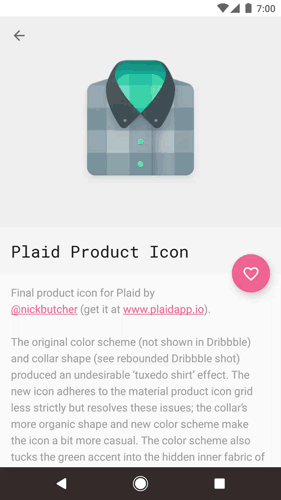

# Animator Duration Quick Settings Tile

A quick settings tile to quickly toggle the animator duration scale:

1. Pressing the tile toggles between 5x & 1x duration scales.
2. Long pressing the tile allows selecting from the full choice of scales.

Note that this app requires you to **manually grant permission** to allow the app to alter the animator duration setting. To do this, issue the following `adb` command:

`adb shell pm grant uk.co.nickbutcher.animatordurationtile android.permission.WRITE_SECURE_SETTINGS`

This app also only runs on Nougat+ devices.

👉 **[Download APK](https://github.com/nickbutcher/AnimatorDurationTile/releases)** 👈




This is not an official Google product.


### License


```
Copyright 2016 Google, Inc.

Licensed to the Apache Software Foundation (ASF) under one or more contributor
license agreements. See the NOTICE file distributed with this work for
additional information regarding copyright ownership. The ASF licenses this
file to you under the Apache License, Version 2.0 (the "License"); you may not
use this file except in compliance with the License. You may obtain a copy of
the License at

http://www.apache.org/licenses/LICENSE-2.0

Unless required by applicable law or agreed to in writing, software
distributed under the License is distributed on an "AS IS" BASIS, WITHOUT
WARRANTIES OR CONDITIONS OF ANY KIND, either express or implied. See the
License for the specific language governing permissions and limitations under
the License.
```
